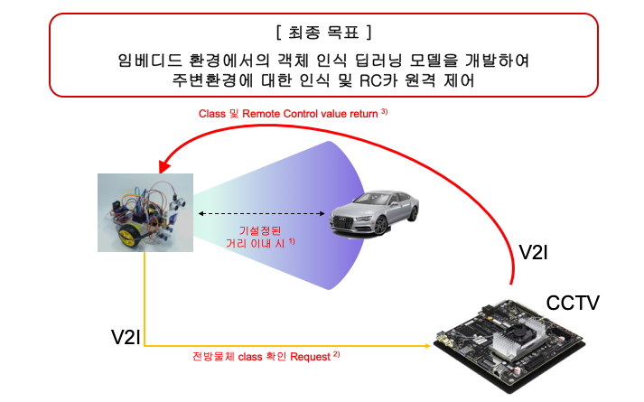
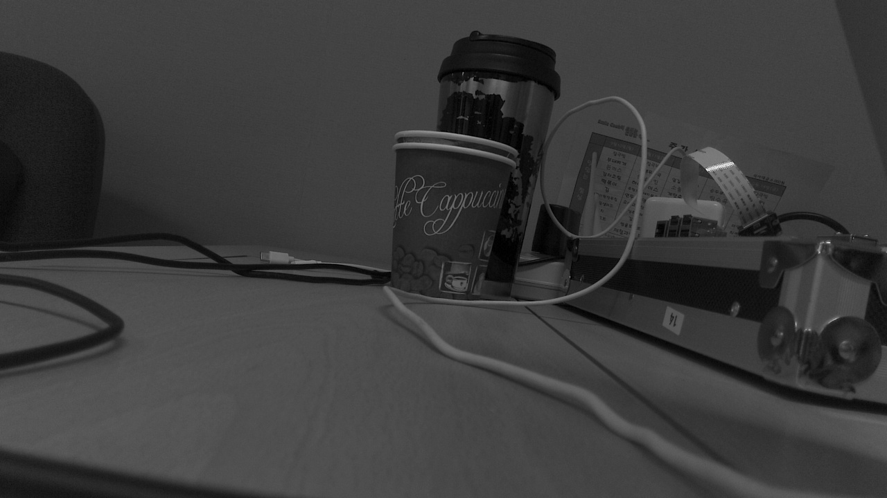
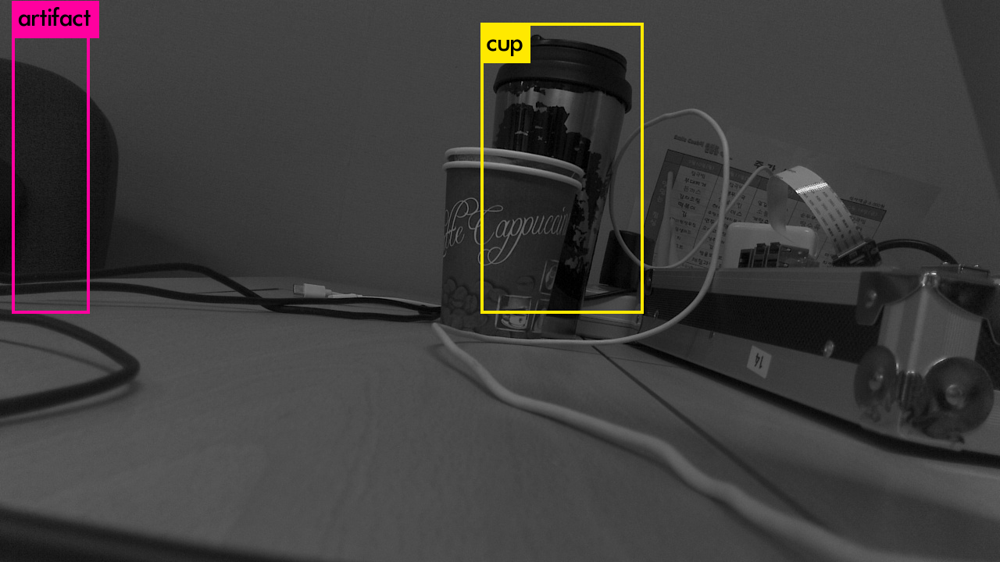
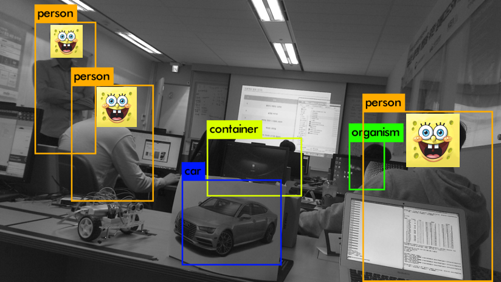

# Table of Contents

- [Intro](#intro)
- [Requirement](#requirement)
- [Structure](#structure)
  * [Server](#server)
  * [Client](#client)
  * [Installation](#installation)
- [Usage](#usage)
  * [MAKEFILE](#makefile)
  * [Detection](#detection)
  * [How to Run](#how-to-run)
- [TX1 YOLO Conclusion](#tx1-yolo-conclusion)
- [System Integration](#system-integration)
  * [[Server]TX1](#-server-tx1)
  * [[Client]Raspberry](#-client-raspberry)
- [Reference](#reference)


## Intro

**YOLO-9000**

> YOLO는 실시간 다중객체 인식 모델입니다. YOLO에서 이미 학습한 가중치를 기준으로 객체를 판별합니다.
>

그중 [YOLO-9000](https://github.com/philipperemy/yolo-9000)은 약 9000가지 객체를 판별할수 있습니다.

저희는 이미 학습된 가중치를 이용하여 객체를 검출 하려고 합니다.


**Minimal V2I**

RC카와 TX1과의 통신으로 전방의 사진을 찍고 YOLO를 통해 판별된 객체정보를 다시 RC카에 송신하여 사람이면

작동을 멈추고 차가 인지되면 피해가는 알고리즘을 구성하려고 합니다.




## Requirement

**Jetson TX1**

TX1보드를 서버이자 CCTV역할로 사용하였습니다. 라즈베리 자체에서 YOLO를 동작 시키기엔

라즈베리의 성능적인 측면에서 제한사한이 많아 GPU를 사용할수 있는 TX1에 서버를 두었습니다.

저희 프로젝트에서는 서버측이 CCTV역할을 하기 때문에 반드시 카메라를 사용해야 합니다.


**RaspberryPi3**

Client로 사용할 보드를 라즈베리파이를 사용했습니다.

모터 제어는 모터드라이버를 통한 제어가 아닌 WiringPi Lib의 PWM을 통한 모터제어를 했습니다.

 

**RC car**

RC car는 client로 사용할수 있는 기기면 어떤것이든 상관없습니다.

저희는 라즈베리파이3 를 client로 두고 Rc car를 제어 했습니다.

[Rc car 링크](http://shopping.interpark.com/product/productInfo.do?prdNo=4495250212&dispNo=016001&utm_medium=affiliate&utm_source=danawa&utm_campaign=shop_p11736_p01415&utm_content=main)


## Structure

### Server

```shell
darknet/
├── Log
├── Makefile
├── cfg
├── data
├── examples
├── img
├── include
├── python
├── scripts
└── src
```

Server는 기존의 darknet main에 integration했습니다. 컴파일후 다크넷 실행시 바로 서버가 실행됩니다.

Port number는 원하시는걸로 바꿔주세요.


### Client

```shell
communication/
├── [Testing]txserver
└── raspclient
```

Client는 라즈베리파이에서 동작해야 되 WringPi Lib가 있어야 합니다.

client는 raps-client안에 있고 Rc control module과 client를 integration했습니다.


### Installation

```shell
installation/
├── Jetson_TX1_TX2_Developer_Kit_Camera_Module_Design_Files_A01
├── Readme.md
├── TensorWheel
├── Tensorinstallscript
├── opencv
└── opencv_3.2
```


**Jetson_TX1_TX2_Developer_Kit_Camera_Module_Design_Files_A01 **

Jetson TX1에서 사용되는 CSI camera spec과 API에 대한 자세한 내용이 들어있습니다.

저도 이부분은 검색하다가 알게되었네요. [출처 : elinux.org](https://elinux.org/Jetson_TX1)


**TensorWheel & Tensorinstallscript** 

whl 파일로 tensor를 설치하고자 할때 사용 하시면 됩니다.

근데 tensor도 intel cpu 인지 arm cpu인지에 따라서 설치 파일이 달라집니다.

저희는 서버에서 Tensor를 사용해야 했고, TX1에서 사용 하는 ARM Cortex-A57에서

설치 가능한 whl파일을써야합니다. 또한 해당 보드의 버전에 맞는 tensor 버전을 맞춰야 합니다.

여기서 골때리는게 Jetson Tx1에 tegra-Ubuntu 를 설치시에 설정 해주면 자동으로 CUDA가 설치됩니다.

제가 사용한 버전은 1.3.2 버전이고 CUDA-9.0이 사용되었는데, 기존의 tensor install script를 보면 CUDA-8.0에

대해서 설치가 진행되는 소스가 많더군요.

암튼 신경써야 할것은 **TX1의 버전, CUDA 버전, ARM Processor 전용 wheel 사용** 이 3가지 입니다.


**opencv & opencv_3.2**

Jetson TX1에서 openCV 설치도 문제가 많았습니다. tensor때와 비슷한 이유로 몇몇 lib들이

지원이 되지 않아 openCV필요 라이브러리를 수동으로 설치해야 했습니다.

설치 스크립트를 실행 하면 자동으로 설치 됩니다.


## Usage

### MAKEFILE

1. TX1환경에서 GPU를 사용하기 위해 YOLO의 Makefile을 수정했습니다.

  >  Supported SM and Gencode variations
  >
  >  Supported on CUDA 7 and later
  >
  > **SM53 or SM_53, compute_53 – Tegra (Jetson) TX1 / Tegra X1**

  <출처 : http://arnon.dk/matching-sm-architectures-arch-and-gencode-for-various-nvidia-cards/>

  ```makefile
  GPU=1
  CUDNN=0
  OPENCV=0
  OPENMP=0
  DEBUG=0
  #tx1 gpu type and Matching architecture
  ARCH= -gencode arch=compute_53,code=[sm_53,sm_53] \
  -gencode arch=compute_53,code=sm_53 \
  -gencode arch=compute_53,code=sm_53 \
  -gencode arch=compute_53,code=[sm_53,compute_53] \
  -gencode arch=compute_53,code=[sm_53,compute_53]
  ```

  제가 사용했던 Jetson TX1에 해당하는 GPU type에 맞는 버전을 사용했고, 혹시 GPU환경이 다른분들은 위의 출처에 들어 가서셔 맞는 type을 찾으시길 바랍니다.


2. Tx1 CSI camera excute Python source

   c++에서 opencv를 이용한 TX1 camera 사용이 안되서, Python을 이용하여 CSI camera를 사용했습니다.

   ```python
   ...
   cap = cv2.VideoCapture("nvcamerasrc ! video/x-raw(memory:NVMM), width=(int)1280, height=(int)720,format=(string)I420, framerate=(fraction)30/1 ! nvvidconv flip-method=0 ! video/x-raw, format=(string)BGRx ! videoconvert ! video/x-raw, format=(string)BGR ! appsink")
   ...
   ```

   darknet	에서 python source를 실행하기 위해 darknet에서 System call을이용해 python source를 실행합니다.

3.  Writing Log

   Client와 Server의 동작 사항에 대한 Log 파일 작성 함수를 추가했습니다.

   현재 시간 [Hour:Min]으로 Server 와 Client의 수행 내용을 기록합니다.

   ```shell
   [9-28 0:43:45] [TX 1] Detecting :chair Leftcar Leftdish Left
   [9-28 0:46:10] [TX 1] Detecting :armchair Leftcar Leftcontainer Left
   [9-28 1:8:54] [TX 1] Detecting :car Left
   ```


### Detection

YOLO에서 미리 학습된 가중치 **yolo9000.weights** 의 값을 기준으로 객체를 판단합니다.

YOLO는 가중치를 통해 나온 threshold 값이 0.2이상인 객체만 판별합니다.

만약 threshold값을 0을 준다면 인지한 모든 객체가 표시됩니다.


### How to Run

```shell
./darknet detector <test/train> <*.data> <*.cfg> <*.wegiths>
```

1. Train

   ```shell
   ./darknet detector train cfg/voc.data cfg/yolov3-voc.cfg darknet53.conv.74
   ```

   가중치를 training 할때에 PASCAL -VOC 데이터를 이용합니다.(cf. COCO, IMAGNET)

2. Test

   ```shell
   ./darknet detector test cfg/coco.data cfg/yolo.cfg yolo.weights data/dog.jpg
   ```

   학습된 가충치를 통해 사진 혹은 영상에 존재하는 객체들을 검출합니다.

3. NIconeco Usage

   프로토타입의 실행을 위해 우선 인자값을 고정해 놨습니다.

   ```shell
   ./darknet detector test -i -gpus 1
   ```

   추가 인자 값으로 `-gpus` 의 값에 1을 주어 GPU가 동작 되도록 설정했습니다.


## TX1 YOLO Conclusion

```shell
$ ./darknet detector test -i -gpus 1
Available Sensor modes : 
2592 x 1944 FR=30.000000 CF=0x1109208a10 SensorModeType=4 CSIPixelBitDepth=10 DynPixelBitDepth=10
2592 x 1458 FR=30.000000 CF=0x1109208a10 SensorModeType=4 CSIPixelBitDepth=10 DynPixelBitDepth=10
1280 x 720 FR=120.000000 CF=0x1109208a10 SensorModeType=4 CSIPixelBitDepth=10 DynPixelBitDepth=10

NvCameraSrc: Trying To Set Default Camera Resolution. Selected sensorModeIndex = 1 WxH = 2592x1458 FrameRate = 30.000000 ...

layer     filters    size              input                output
    0 conv     32  3 x 3 / 1   544 x 544 x   3   ->   544 x 544 x  32
    1 max          2 x 2 / 2   544 x 544 x  32   ->   272 x 272 x  32
    2 conv     64  3 x 3 / 1   272 x 272 x  32   ->   272 x 272 x  64
    3 max          2 x 2 / 2   272 x 272 x  64   ->   136 x 136 x  64
    4 conv    128  3 x 3 / 1   136 x 136 x  64   ->   136 x 136 x 128
    5 conv     64  1 x 1 / 1   136 x 136 x 128   ->   136 x 136 x  64
    6 conv    128  3 x 3 / 1   136 x 136 x  64   ->   136 x 136 x 128
    7 max          2 x 2 / 2   136 x 136 x 128   ->    68 x  68 x 128
    8 conv    256  3 x 3 / 1    68 x  68 x 128   ->    68 x  68 x 256
    9 conv    128  1 x 1 / 1    68 x  68 x 256   ->    68 x  68 x 128
   10 conv    256  3 x 3 / 1    68 x  68 x 128   ->    68 x  68 x 256
   11 max          2 x 2 / 2    68 x  68 x 256   ->    34 x  34 x 256
   12 conv    512  3 x 3 / 1    34 x  34 x 256   ->    34 x  34 x 512
   13 conv    256  1 x 1 / 1    34 x  34 x 512   ->    34 x  34 x 256
   14 conv    512  3 x 3 / 1    34 x  34 x 256   ->    34 x  34 x 512
   15 conv    256  1 x 1 / 1    34 x  34 x 512   ->    34 x  34 x 256
   16 conv    512  3 x 3 / 1    34 x  34 x 256   ->    34 x  34 x 512
   17 max          2 x 2 / 2    34 x  34 x 512   ->    17 x  17 x 512
   18 conv   1024  3 x 3 / 1    17 x  17 x 512   ->    17 x  17 x1024
   19 conv    512  1 x 1 / 1    17 x  17 x1024   ->    17 x  17 x 512
   20 conv   1024  3 x 3 / 1    17 x  17 x 512   ->    17 x  17 x1024
   21 conv    512  1 x 1 / 1    17 x  17 x1024   ->    17 x  17 x 512
   22 conv   1024  3 x 3 / 1    17 x  17 x 512   ->    17 x  17 x1024
   23 conv  28269  1 x 1 / 1    17 x  17 x1024   ->    17 x  17 x28269
   24 detection
mask_scale: Using default '1.000000'
Loading weights from ../yolo9000-weights/yolo9000.weights...Done!
examples/test_cam.jpg: Predicted in 1.123204 seconds.
artifact: 25%
center x = 64 
center y = 223 
cup: 47%
center x = 719 
center y = 215 
```


**test img**




**Detection img**




## System Integration

### [Server]TX1

```c
TxServer started up @Target :7002. Waiting for client(s)...

Communication started with 192.168.106.7:46272
1th client entered.
>> read cmd = Car is Right lane
NvCameraSrc: Trying To Set Default Camera Resolution. Selected sensorModeIndex = 1 WxH = 2592x1458 FrameRate = 30.000000 ...
layer     filters    size              input                output
    0 conv     32  3 x 3 / 1   544 x 544 x   3   ->   544 x 544 x  32
    1 max          2 x 2 / 2   544 x 544 x  32   ->   272 x 272 x  32
    2 conv     64  3 x 3 / 1   272 x 272 x  32   ->   272 x 272 x  64
    3 max          2 x 2 / 2   272 x 272 x  64   ->   136 x 136 x  64
									...
   23 conv  28269  1 x 1 / 1    17 x  17 x1024   ->    17 x  17 x28269
   24 detection
mask_scale: Using default '1.000000'
Loading weights from ../yolo9000-weights/yolo9000.weights...Done!
examples/test_cam.jpg: Predicted in 0.787100 seconds.
									...
car: 63%
center x = 591 
center y = 567 
Image Class Name = car
Image width = 255
Image height = 219
Image Center_x = 591
Image Center_y = 567
Please seding message
send command to client => Car Left
read log : [9-28 1:57:52] [TX 1] Detecting :car Left
Success sending command
```


### [Client]Raspberry

```c
Raspberry client Start
Somthing there
Start connetcServe..
Connetecd.. sockfd : 4
reqest : r(Right lane)

Receive Success And We will go to [car Left]
Now Switch left lane and go
>> Complete execution !!!
Recv_form_server: car
############################
Somthing there
Start connetcServe..
...
    

```




## Reference

[번역](https://github.com/zeuseyera/darknet-kr/blob/master/2_YOLO/yolo.md)

[YOLO-9000](https://github.com/philipperemy/yolo-9000)

[elinux.org](https://elinux.org/Jetson_TX1)